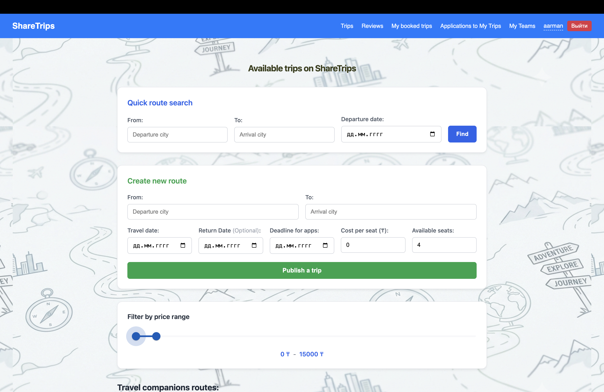
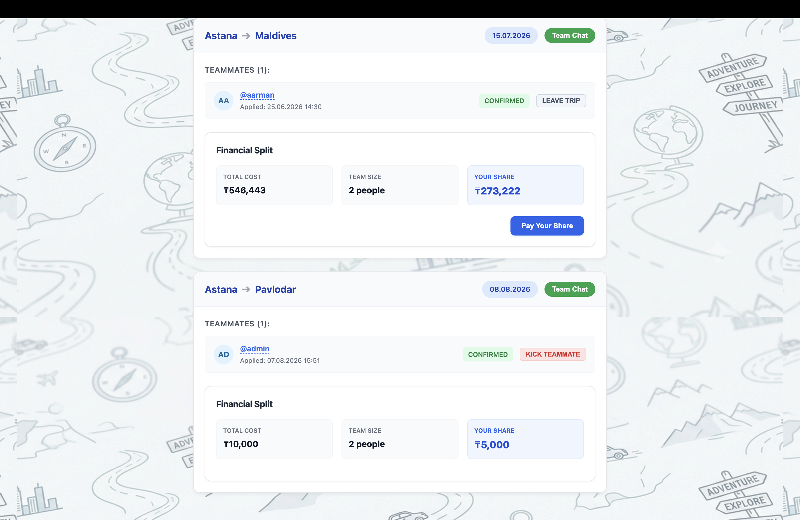
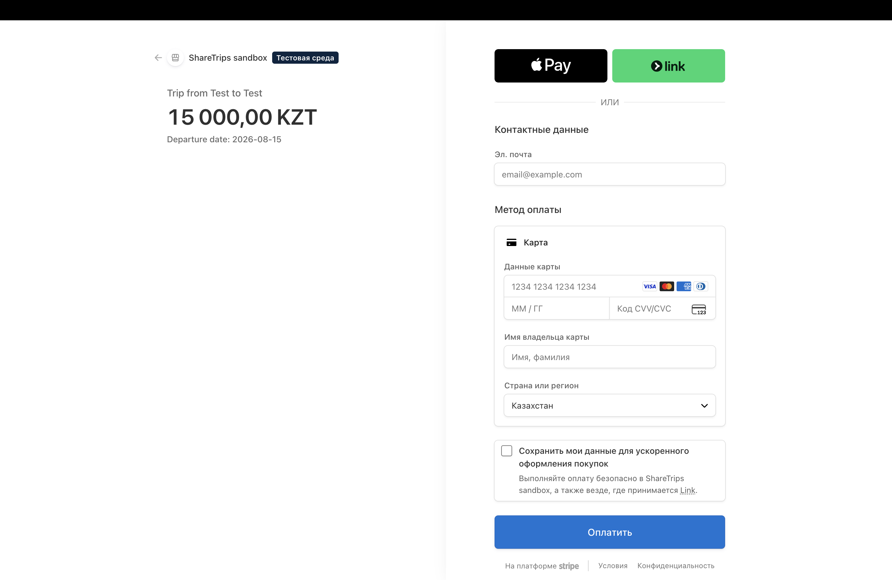

# Carpooling & Ridesharing Platform


A full-stack web platform designed to connect drivers and passengers for intercity travel. The system automates trip creation, passenger seat reservations, application approval workflows, live payment deadline timers, and post-trip peer reviews.

---

## Project Overview & Problem Statement

Intercity travel often presents challenges such as uncoordinated scheduling, lack of transparent seat booking, and high cancellation rates due to non-committal reservations.

This platform addresses these issues by providing:

* **Automated Seat Management:** Real-time tracking of available vehicle seats and trip status transitions.
* **Payment Deadline Enforcement:** A time-bound payment system to prevent seat holding and reduce last-minute cancellations.
* **Driver Protection:** Domain validation preventing self-applications and unauthorized modifications.
* **Trust & Accountability:** Integrated post-trip review system for both drivers and passengers.

---

## Tech Stack & Architecture

### **Backend**

* **Framework:** Python 3.12+, Django 6.0.6, Django REST Framework (DRF)
* **Authentication:** Token-based Authentication (`rest_framework.authtoken`)
* **Payment Integration:** Stripe API (Checkout Sessions & Webhook Handlers)
* **Database:** PostgreSQL / SQLite (Development)

### **Frontend**

* **Framework:** Angular 21 (Standalone Components, RxJS, ChangeDetectionRef)
* **UI & Styling:** Angular Material, SCSS, Responsive Flexbox/Grid Architecture
* **State & Routing:** Angular Router, HttpClient, Dynamic Local Storage Management

---

## Key Features

### Trip & Application Workflow

* **Trip Creation:** Drivers define routes, departure dates, available seats, and cost per passenger.
* **Self-Application Shield:** Backend validation prevents trip creators from sending join requests to their own routes.
* **Application Lifecycle:** `pending` ➔ `waiting_payment` / `accepted` ➔ `paid` / `rejected`.

### Real-time Payment Countdown

* Approved passengers are assigned a strict **1-hour payment window**.
* **Frontend Countdown:** Angular component calculates remaining time dynamically with visual fallback statuses.
* **Lazy Expiration Handling:** Expired applications automatically release reserved seats back to the trip pool.

### Stripe Payment Processing

* Seamless redirection to Stripe Checkout for secure transaction handling.
* Asynchronous payment verification via backend endpoint routes.

### Team Dashboard & Peer Reviews

* **Grouped Trips View:** Clear visualization of confirmed teammates, trip creators, and payment statuses (`Paid` / `Not Paid`).
* **Member Management:** Drivers retain options to remove passengers, while passengers can voluntarily exit trips.
* **Review Dialog:** Interactive rating system unlocked upon trip completion (`Trip has ended`).

---

## Application Preview

|              Main Feed & Search              |                 Team Management & Timer                 |
| :------------------------------------------: | :-----------------------------------------------------: |
|  |  |

|                    Payment Integration                    |                    Passenger Requests                    |
| :-------------------------------------------------------: | :------------------------------------------------------: |
|  |  |

---

## Installation & Local Setup

### Prerequisites

* **Node.js:** `v24+`
* **Python:** `v3.12`
* **Package Managers:** `npm`, `pip`

---

### 1. Backend Setup (Django REST Framework)

```bash
# Navigate to backend directory
cd backend

# Create and activate virtual environment
python -m venv venv
source venv/bin/activate  # On Windows: venv\Scripts\activate

# Install dependencies
pip install -r requirements.txt

# Configure environment variables (.env)
# STRIPE_SECRET_KEY=your_stripe_secret_key
# SECRET_KEY=your_django_secret_key

# Apply database migrations
python manage.py makemigrations
python manage.py migrate

# Start development server
python manage.py runserver
```

Server will run at: `http://localhost:8000/`

---

### 2. Frontend Setup (Angular)

```bash
# Navigate to frontend directory
cd frontend

# Install project dependencies
npm install

# Start development server
ng serve
```

Application will run at: `http://localhost:4200/`

---

## Development & Testing

### Backend Unit Tests

```bash
cd backend
python manage.py test
```

### Frontend Unit Tests

```bash
cd frontend
ng test
```

---

## Build Commands

To create a production-ready build for the frontend:

```bash
cd frontend
ng build --configuration production
```


## To Do & Future Scope

- [ ] **Driver Loss Protection:** Add `min_passengers` threshold to auto-cancel trips or recalculate seat pricing if minimum capacity isn't met.
- [ ] **Cancellation Policy:** Implement non-refundable deposit/cancellation fee transferred to the driver for last-minute passenger dropouts.
- [ ] Add automated Telegram/Email notifications for payment deadline alerts.

---

## Author & Developer

**Asset Abdirakhman** — *Full-Stack Developer*

* **GitHub:** [@assetbyte](https://github.com/assetbyte)
* **Email:** [asetabdrahman3@gmail.com](mailto:asetabdrakhman3@gmail.com)

